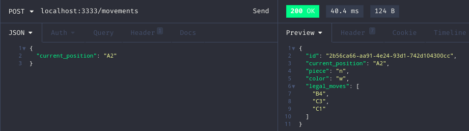
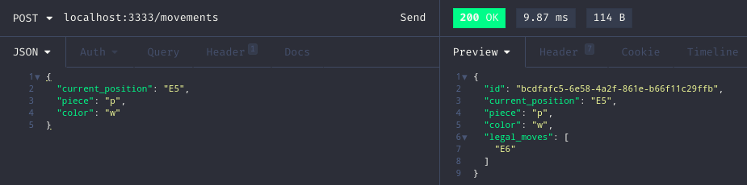

# Chess move generation API

Chess pieces legal movements generation API with chess.js. The API was built with
Redis cache provider, thus, as soon as the movement is created its result list
is stored in cache, which speeds up the following requests.

## Getting Started

These instructions will get you a copy of the project up and running on your local machine for development and testing purposes. See deployment for notes on how to deploy the project on a live system.

### Prerequisites

[Git](https://git-scm.com),
[Node.js](https://nodejs.org/en/)

### Installing

Download or clone the source code on a local folder.

```
git clone https://github.com/adroaldopagliari/chess-move-generation.git
```

Open the project folder and type (installing the dependencies):

```
npm install
```
or
```
yarn
```

Afterwards, run the command and executes the application on devlopment mode:

```
npm dev:server
```
or
```
yarn dev:server
```

Chess move generation API will be running on:

```
http://localhost:3333
```

## Available route

List all the legal knight movements, given its current position (square),
in algebric notation.

POST /movements

```
http://localhost:3333/movements
```

Basic usage example:

```
post http://localhost:3333/movements
```

<p align="center">
  
</p>

Other acceptable input parameters (piece and color):
 - Piece representation:
  * - "p" for Pawn
  * - "n" for Knight
  * - "b" for Bishop
  * - "r" for Rook
  * - "q" for Queen
  * - "k" for King


<p align="center">
  
</p>

Expected result set (json):

1. id: Unique identifier (It's gonna be useful when rendering in a list).
2. current_position: It represents the piece square on the board.
3. piece: Selected piece on the board.
 * - "p" for Pawn
 * - "n" for Knight
 * - "b" for Bishop
 * - "r" for Rook
 * - "q" for Queen
 * - "k" for King
4. color: White or Black.
5. legal_moves: List containing all the valid moves for the selected piece in the current_position.

```
{
  "id": "bcdfafc5-6e58-4a2f-861e-b66f11c29ffb",
  "current_position": "E5",
  "piece": "p",
  "color": "w",
  "legal_moves": [
    "E6"
  ]
}
```

## Running the tests

In order to run the tests, open the project folder and type:

```
npm test --coverage
```
or
```
yarn test --coverage
```

After running the test coverage, access the test report, go to the folder
coverage/lcov-report and open up the index.html file on the browser to go through
the details.

### Break down into end to end tests

There're three tests to cover the GenerateMovementsService.ts:

1. It should be able to list the knight movements, given the current position.
2. It should be able to list other pieces movements.
3. It should not be able to move a piece to an invalid position.

```
Given the following input:
current_position: 'E2'

The expected result is:
['C3', 'D4', 'F4', 'G3', 'G1', 'C1']
```

## Deployment

In the project folder, type:

```
npm build
```
or
```
yarn build
```

A dist folder will be create with all the files needed to
deploy the API.

## Built With

* [Node.js](https://nodejs.org/en/)
* [Typescript](https://www.typescriptlang.org/)
* [Redis](https://redis.io/)

## Contributing

1. Fork the project.
2. Create a new branch with your changes: `git checkout -b my-feature`
3. Save your changes and create a commit message telling what you did: `git commit -m" feature: My new feature "`
4. Submit your changes: `git push origin my-feature`

Please read [CONTRIBUTING.md](CONTRIBUTING.md) for details on our code of conduct, and the process for submitting pull requests to us.

## Versioning

v1.0.0

## Author

* **Adroaldo Pagliari** - *Initial work* - [ChessMovement](https://github.com/adroaldopagliari)

[](https://www.linkedin.com/in/adroaldo-pagliari-5856363b/)
[](mailto:adroaldo1@gmail.com)

## License

This project is licensed under the MIT License - see the [LICENSE.md](LICENSE.md) file for details

## Acknowledgments

* Hat tip to anyone whose code was used
* Meritt who gave me an opportunity to 'show the code'
